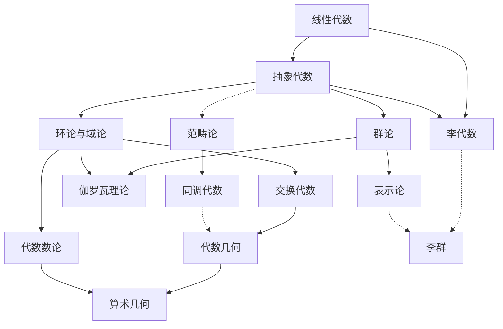

<h2>代数</h2>

线性代数、抽象代数（群、环、域、模）、范畴论、表示论、交换代数，算术几何是数论的一个领域

<posts-list>

<title-link> 
css_source/main_style.css
Linear Algebra,线性代数
[2025-8-10](./Linear-Algebra/index.md)
</title-link>

</posts-list>