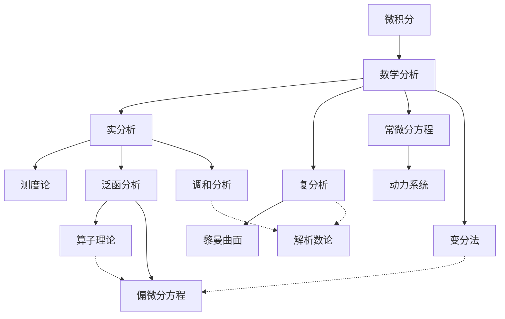

 
<h2>分析学</h2>

实分析、复分析、泛函分析、调和分析、微分方程

```mermaid
%%{init: {"themeVariables": {"fontSize": "18px"}, "flowchart": {"nodeSpacing": 35, "rankSpacing": 45}}}%%
flowchart TB
    CALC["微积分"] --> MA["数学分析"]

    MA --> RA["实分析"]
    MA --> CA["复分析"]
    MA --> ODE["常微分方程"]
    MA --> VAR["变分法"]

    RA --> MEASURE["测度论"]
    RA --> FA["泛函分析"]
    RA --> HA["调和分析"]

    FA --> OP["算子理论"]
    FA --> PDE["偏微分方程"]

    ODE --> DS["动力系统"]

    CA --> RS["黎曼曲面"]
    CA -.-> ANT["解析数论"]
    HA -.-> ANT

    VAR -.-> PDE
    OP -.-> PDE
```