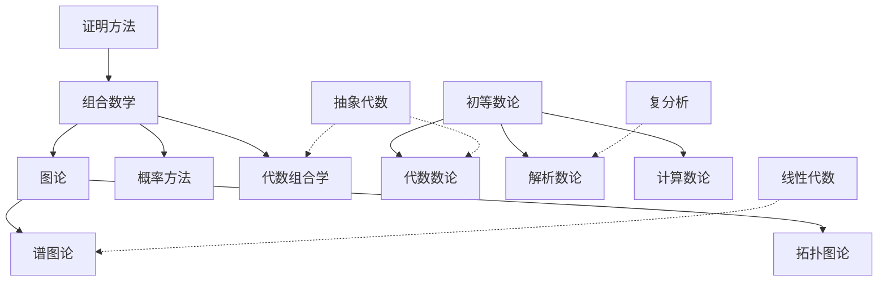

 
<h2>数论与组合</h2>

数论从最简单的对象**整数**出发，却产生了诸多具有深度的问题，发展了许多新兴理论，初等数论一大核心作用是培养证明能力，高级阶段会与代数、分析和几何交叉，是众多分支的交汇点。

```mermaid
%%{init: {"themeVariables": {"fontSize": "18px"}, "flowchart": {"nodeSpacing": 35, "rankSpacing": 45}}}%%
flowchart TB
    METHOD["证明方法"] --> COMB["组合数学"]
    COMB --> GRAPH["图论"]
    COMB --> PM["概率方法"]
    COMB --> AC["代数组合学"]

    GRAPH --> SG["谱图论"]
    GRAPH --> TG["拓扑图论"]

    ENT["初等数论"] --> ANT["代数数论"]
    ENT --> ANNT["解析数论"]
    ENT --> CNT["计算数论"]

    LA["线性代数"] -.-> SG
    ALG["抽象代数"] -.-> AC
    ALG -.-> ANT
    CA["复分析"] -.-> ANNT
```

组合、图论研究离散对象与对象之间的关系，在LLM推理中，会使用计算图来描述计算的执行过程，在分布式计算、计算机网络中，也会使用图论研究问题。