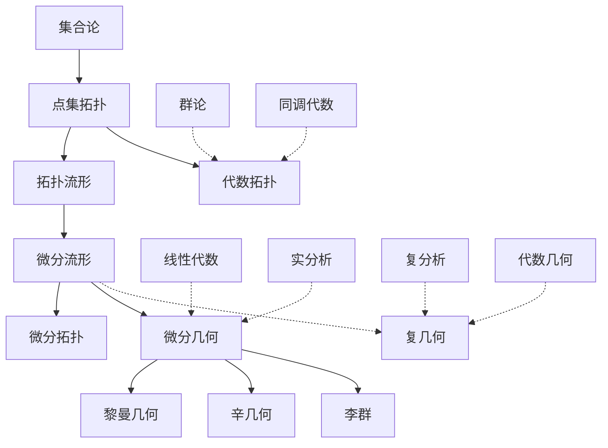

<h2>几何与拓扑</h2>

点集拓扑、代数拓扑、微分拓扑、微分几何、黎曼几何、代数几何

```mermaid
%%{init: {"themeVariables": {"fontSize": "18px"}, "flowchart": {"nodeSpacing": 35, "rankSpacing": 45}}}%%
flowchart TB
    SET["集合论"] --> PT["点集拓扑"]

    PT --> TM["拓扑流形"]
    PT --> AT["代数拓扑"]

    TM --> DM["微分流形"]
    DM --> DT["微分拓扑"]
    DM --> DG["微分几何"]

    DG --> RG["黎曼几何"]
    DG --> SG["辛几何"]
    DG --> LG["李群"]

    GROUP["群论"] -.-> AT
    HOM["同调代数"] -.-> AT

    LA["线性代数"] -.-> DG
    RA["实分析"] -.-> DG

    CA["复分析"] -.-> CG["复几何"]
    DM -.-> CG
    AG["代数几何"] -.-> CG
```